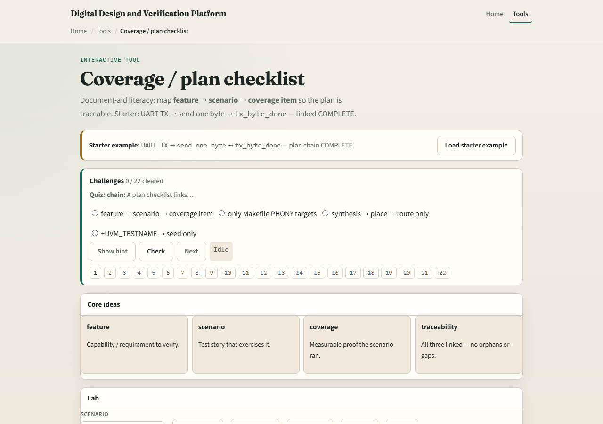

# Coverage / plan checklist

A verification plan is not a pile of test names

---

## Feature, scenario, coverage
- Feature means requirement or capability, say UART transmit
- Scenario is the test story, send one byte
- Coverage is the measurable proof
- Complete means all three layers link
- Incomplete means a gap: a scenario with no coverage, or coverage with no owning feature

---

## Browser lab

---

## Planning docs practice
- On paper or markdown, write one row with three columns: feature, scenario, coverage item
- Use a tiny UART or SPI capability you know
- Then deliberately delete the coverage cell and ask: how would I know this scenario ran?
- That question is the whole module

---

## Pitfalls to watch
- Do not treat the board as a live coverage database
- Do not list coverage items with no feature owner, orphans lie
- Do not stop at scenarios without a measurable proof
- And do not confuse “we have a test file” with “we have a coverable claim.”

---

## Your turn
- Complete the checklist for at least one track, preferably both
- In the browser, reach a complete three-layer chain
- On paper, write one feature-scenario-coverage row you could paste into a real plan
- When you are ready, take the short quiz, then continue to test taxonomy

