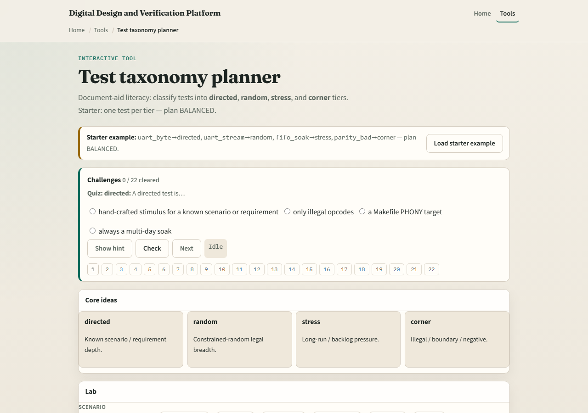

# Test taxonomy

Not every test should be the same shape

---

## Four tiers
- Directed means hand-crafted stimulus for a known scenario
- Random means constrained-legal traffic to explore space
- Stress means long-run, backlog, or concurrent pressure
- Corner means illegal, framing, or rare edges
- Open rows are untyped

---

## Browser lab

---

## Planning docs practice
- List four short test names for a UART-like block and tag each directed
- If everything is directed, rewrite one as random and one as corner
- Say in one sentence why the mix reduces escape risk

---

## Pitfalls to watch
- Do not equate balanced taxonomy with one-hundred percent functional coverage
- Do not leave tests untyped on a living plan
- Do not hide negative cases because they are “hard.” And do not confuse a green CI job with

---

## Your turn
- Complete the checklist for at least one track, preferably both
- Classify a small set until it looks balanced

