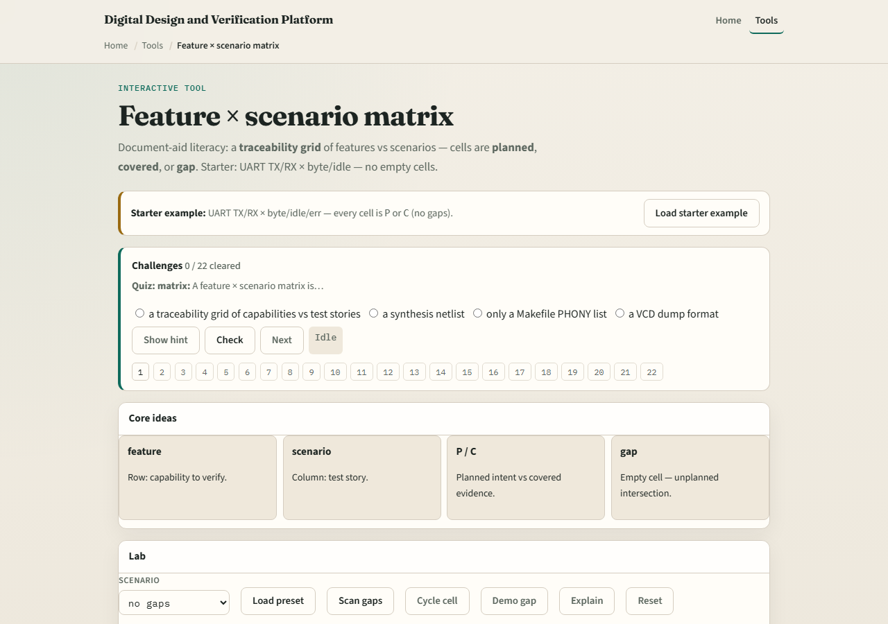

# Feature × scenario matrix

A matrix makes intersections visible

---

## Planned versus covered
- Mark P when you intend a test or story for that intersection
- Mark C when a bin, checklist, or passing directed check proves it
- A board with no empty cells can still be weak if everything is only P
- Closing gaps means either plan the empty cell or produce coverage for a planned one

---

## Browser lab

---

## Planning docs practice
- Draw a two-by-three grid for one block: two features, three scenarios
- Fill each cell with dash, P, or C
- Leave one empty on purpose, then write the next action that would fill it
- That next-action habit is the point of the matrix

---

## Pitfalls to watch
- Do not conflate P with C
- Do not celebrate zero empty cells when nothing is covered
- Do not hide rare scenarios off the grid
- And do not grow the matrix so huge that nobody maintains it, start small and real

---

## Your turn
- Complete the checklist for at least one track, preferably both
- Scan one matrix for gaps, fix or name them, then take the quiz and continue to cover bins

