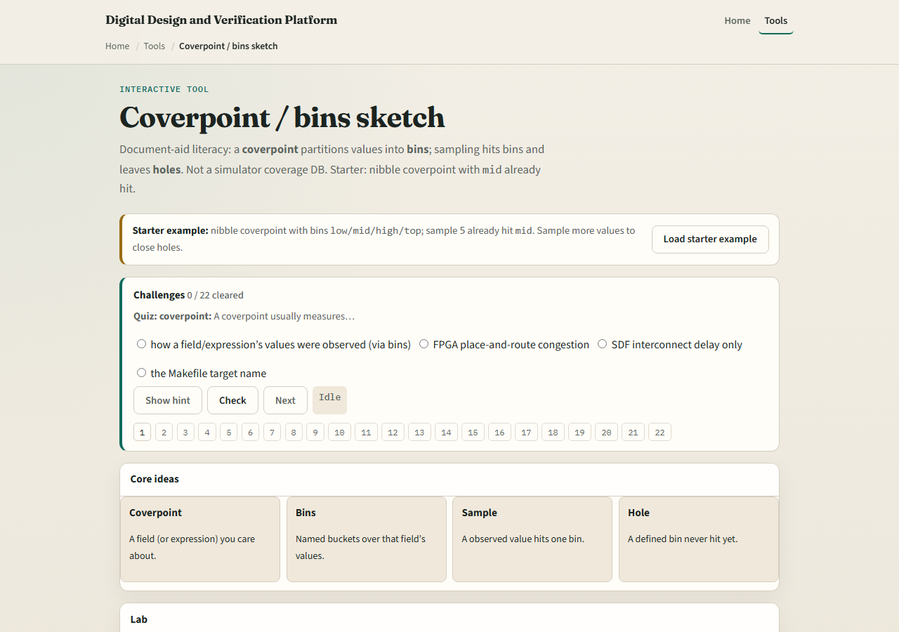

# Cover bins sketch

Coverage closes when defined bins get hits

---

## Sample, hit, hole
- You sample a value into the coverpoint; matching bins increment
- Coverage percent is bins hit over bins defined
- Hitting mid once on a four-bin nibble point is twenty-five percent with three holes left

---

## Browser lab

---

## Planning docs practice
- Sketch one coverpoint with four named bins for a data nibble or opcode set
- Mark which bin you would hit with a directed sample first
- Note one value that sits outside your bins and decide whether to add a bin or ignore it

---

## Pitfalls to watch
- Do not confuse “more random” with hole closure
- Do not redefine holes as every unseen number in nature, only defined bins count
- Do not skip naming bins because cross coverage feels advanced; start with clear singles
- And remember the lab is a sketch, not your simulator’s coverage DB

---

## Your turn
- Complete the checklist for at least one track, preferably both
- Close or name holes on a small bin sketch

