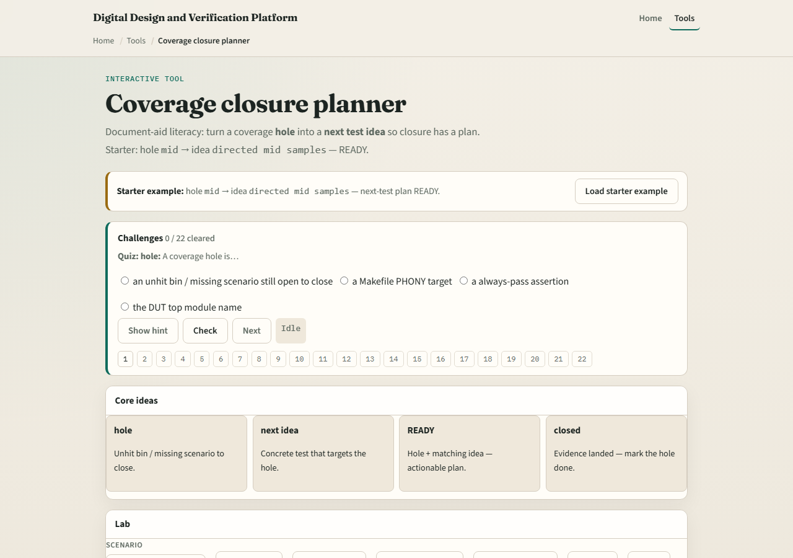

# Module 05 — Coverage closure

**Module id:** module05-coverage-closure
**Lab:** coverage-closure
**Tracks:** A (planning docs) · B (browser lab)

## Slide 1 — Coverage closure

Finding holes is not closing them. Closure means pairing each open bin with a next-test idea, running or planning that idea, then marking the hole closed when evidence lands. Without the pair, status meetings turn into wishful percentages.

## Slide 2 — Hole plus next-test idea

A good idea names how you will hit the hole—directed mid samples, drive an error opcode once, push FIFO until full. Generic “more random” is weak when the hole needs a directed hit. Mismatch means the idea targets the wrong hole. Need-idea means you have not planned the next move.

## Slide 3 — Browser lab

In the coverage-closure lab, load the starter where mid is open and the idea is directed mid samples—ready. Try mismatch and orphan presets. Plan a next test, then mark a hole closed only when the story matches. Challenges punish vague random and reward targeted plans.

## Slide 4 — Planning docs practice

Pick three holes from a tiny cover sketch. Write one next-test idea per hole in a table. Star any idea that is only “run more random” and rewrite it to name the bin or corner you will force.

## Slide 5 — Pitfalls to watch

Do not mark closed without evidence. Do not paste one generic idea onto every hole. Do not ignore mismatch between idea and hole. And do not confuse board ready with silicon sign-off—this is closure hygiene, not a tapeout stamp.

## Slide 6 — Your turn

Complete the checklist for at least one track—preferably both. Pair one hole with a concrete next-test idea, then take the quiz and continue to risk-based planning.
