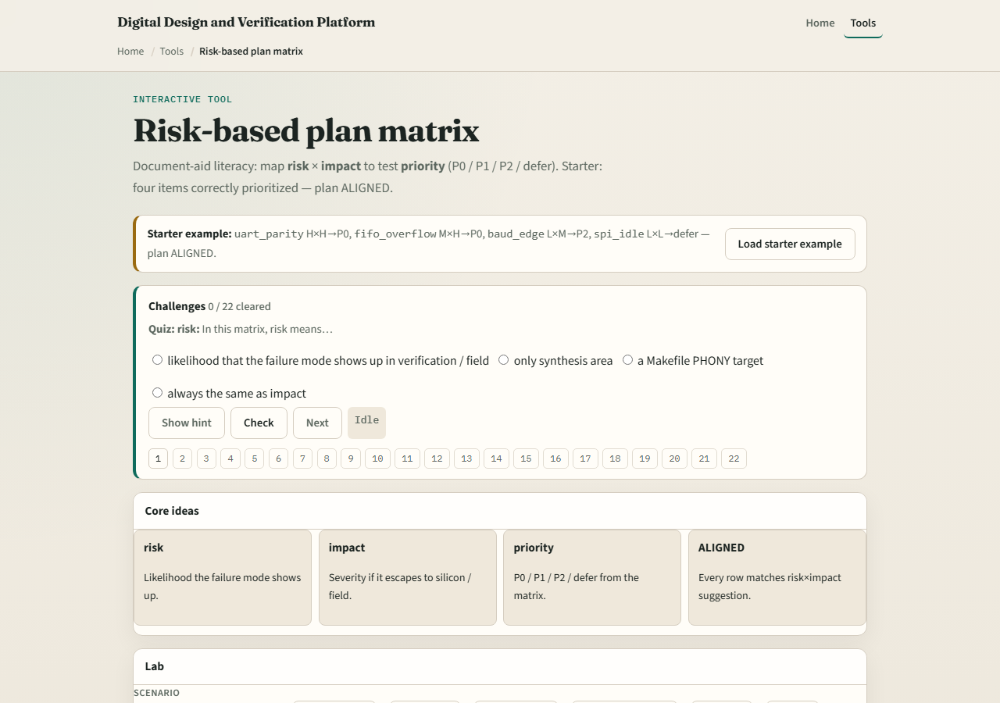

# Risk-based plan

Bandwidth is finite

---

## Risk times impact
- Risk is likelihood; impact is severity if it escapes silicon or a customer
- High-high and medium-high often land as P0
- Low-medium may be P2
- Low-low can defer
- Aligned means your labels match the matrix suggestion

---

## Browser lab

---

## Planning docs practice
- List four bug concerns for a block you know
- Score each likelihood and impact low, medium, or high, then assign P0, P1, P2, or defer
- If more than half are P0, demote two with a written reason

---

## Pitfalls to watch
- Do not mark everything P0
- Do not defer high-likelihood, high-impact items because they are hard
- Do not confuse taxonomy tiers with risk scores, they cooperate but are not the same
- And do not skip owners on deferred items

---

## Your turn
- Complete the checklist for at least one track, preferably both
- Produce a small aligned priority list, then take the quiz and continue to seeds, config

