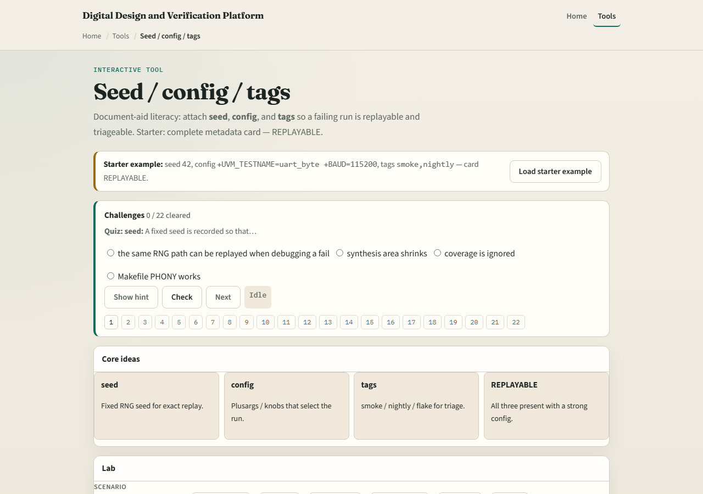

# Seed / config / tags

A failing random test is useless if you cannot replay it

---

## What belongs on the card
- Seed fixes the RNG so stimulus can return
- Config holds plusargs and knobs, test name, baud, modes, not seed alone
- Tags label slices: smoke, nightly, flake, quarantine
- Weak means you recorded a seed but not enough config to relaunch
- Missing any field blocks a clean replay story

---

## Browser lab

---

## Planning docs practice
- Write one run card for an imaginary fail: seed, two plusargs, and two tags
- Then rewrite a bad card that only says “seed seven” and explain why a teammate could not

---

## Pitfalls to watch
- Do not file fails with seed only
- Do not skip tags so flakes vanish from boards
- Do not change knobs while claiming the same seed replay
- And do not treat the literacy board as your company’s database

---

## Your turn
- Complete the checklist for at least one track, preferably both
- Build one replayable run card, then take the quiz and continue to regression triage

