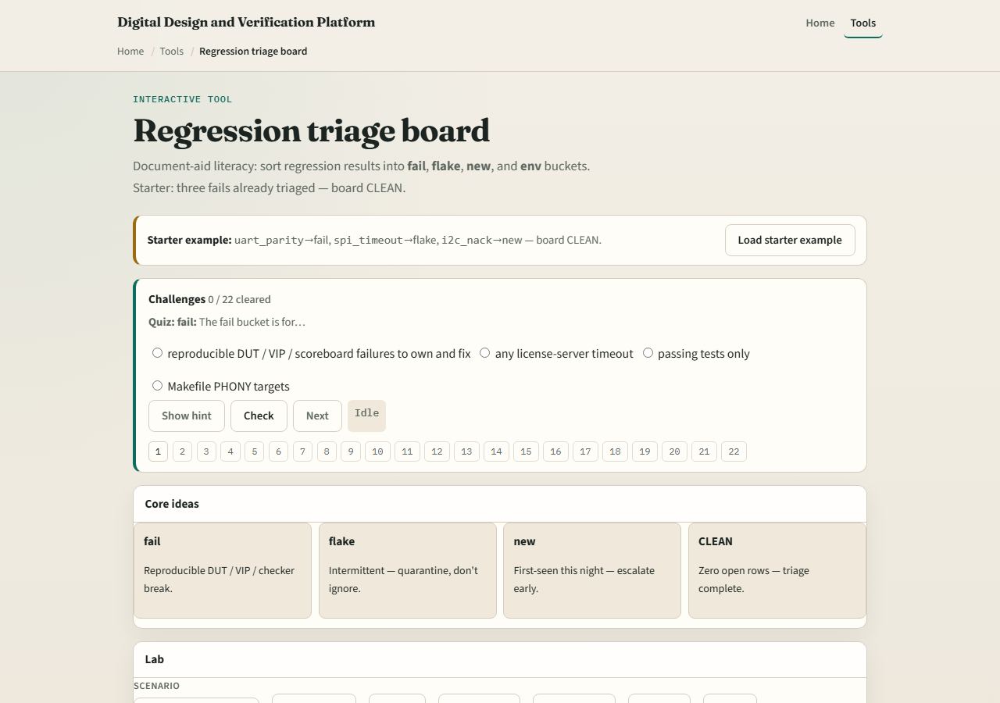

# Module 08 — Regression triage

**Module id:** module08-regression-triage
**Lab:** regression-triage
**Tracks:** A (planning docs) · B (browser lab)

## Slide 1 — Regression triage

Nightly noise without buckets wastes the morning. Triage sorts fails into reproducible DUT or VIP fails, flakes, first-seen new issues, and environment or infra problems. A clean board means every row has a bucket—not that bugs vanished.

## Slide 2 — Fail, flake, new, env

Fail means reproducible design, VIP, or scoreboard breakage—own and fix. Flake means intermittent or seed-sensitive—quarantine and stabilize, do not bury. New means first appearance this run—escalate; do not assume known. Env means license, disk, tool, or farm crash—infra, not RTL.

## Slide 3 — Browser lab

In the regression-triage lab, load the starter with three fails already bucketed—board clean. Open a row, triage it, and scan until open count is zero. Try an environment hit preset. Challenges stop you from leaving rows unlabeled.

## Slide 4 — Planning docs practice

Take three fictional nightly lines and assign fail, flake, new, or env with one-line reasons. Mark which one you would debug first and why. Optional: note which seed-tag fields you would demand on the flake.

## Slide 5 — Pitfalls to watch

Do not mark everything flake to clear the board. Do not treat env red as a DUT bug. Do not ignore new fails because the night was busy. And do not close triage without an owner on real fails.

## Slide 6 — Your turn

Complete the checklist for at least one track—preferably both. Bucket a small board to clean, then take the quiz and continue to verification metrics.
