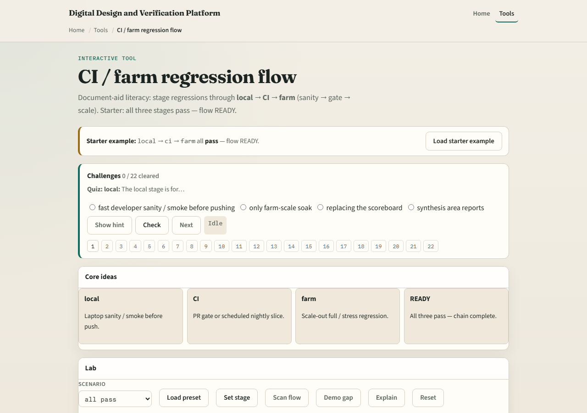

# Module 10 — CI / farm flow

**Module id:** module10-ci-farm-flow
**Lab:** ci-farm-flow
**Tracks:** A (planning docs) · B (browser lab)

## Slide 1 — CI / farm flow

Verification scales in stages: local smoke on a laptop, CI as the merge or scheduled gate, then the farm for scale-out regression and soak. Ready means each stage you claim is green in order. Skipping a stage or promoting past a red gate breaks trust.

## Slide 2 — Local, CI, farm

Local is fast sanity before push. CI is the agent gate—pull request or nightly slice. Farm is where long regressions and stress live. Pass advances; fail blocks; open means not run; skip gaps the chain. A green farm with a failed local or skipped CI is not an honest ready flow.

## Slide 3 — Browser lab

In the CI-farm lab, load the starter with local, CI, and farm all pass—ready. Try local fail or skip CI presets and watch blocked or gapped. Set stages deliberately, then scan the flow. Challenges punish promoting past red.

## Slide 4 — Planning docs practice

Draw three boxes—local, CI, farm—and write what runs in each for your team. Mark yesterday’s real or fictional status pass, fail, open, or skip. If any is fail or skip, write the promotion rule you would enforce.

## Slide 5 — Pitfalls to watch

Do not skip CI because the farm is “more complete.” Do not ignore local reds. Do not treat one green farm night as a full flow. And do not forget that seed and triage habits feed every stage—flow without replay is archaeology.

## Slide 6 — Your turn

Complete the checklist for at least one track—preferably both. Describe or set a clean local-to-farm chain, then take the quiz and continue to sign-off.
