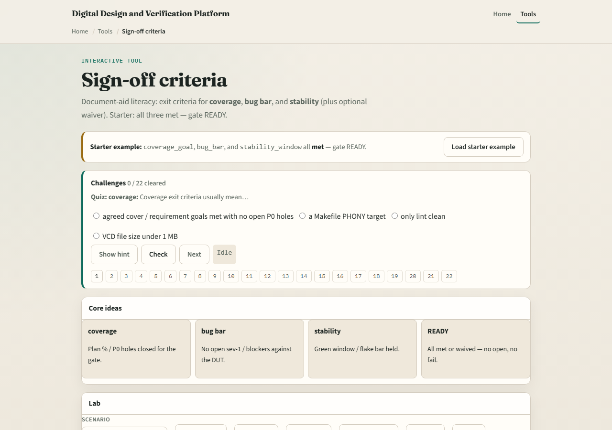

# Sign-off checklist

Sign-off is a gate, not a vibe

---

## Met, open, fail, waived
- Met means evidence exists
- Open means not demonstrated yet
- Fail means the criterion is broken, such as a sev-one still open, and the gate is blocked
- Waived means a written exception with owner

---

## Browser lab

---

## Planning docs practice
- Write three exit criteria for a milestone
- For each, note what evidence you would attach and who owns a waiver if needed
- If any criterion is fail, write what would unblock the gate

---

## Pitfalls to watch
- Do not silent-skip failed criteria
- Do not waive without owner, reason, and expiry
- Do not sign off on coverage percent alone while sev-ones remain
- And do not confuse this literacy checklist with your company’s legal release process

---

## Your turn
- Complete the checklist for at least one track, preferably both
- Walk one gate to ready or name what blocks it

