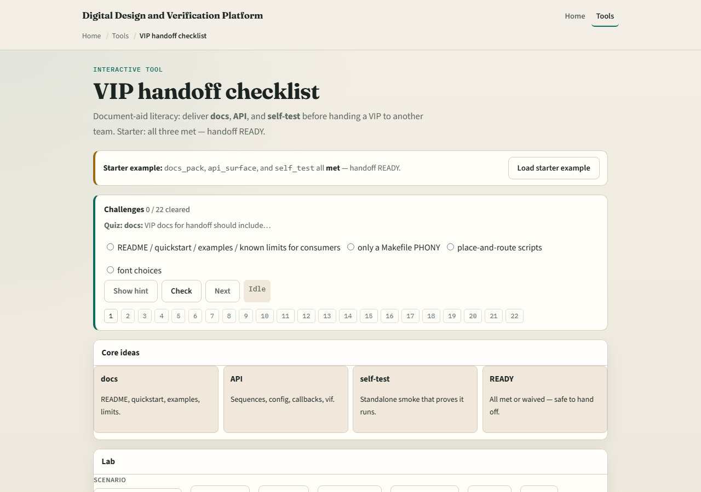

# Module 12 — VIP handoff

**Module id:** module12-vip-handoff
**Lab:** vip-handoff
**Tracks:** A (planning docs) · B (browser lab)

## Slide 1 — VIP handoff

A VIP is not handed off when the agent compiles once. Handoff readiness means consumers can onboard: a docs pack, a clear API surface, and a standalone self-test that proves the VIP runs. Missing any piece blocks a responsible transfer.

## Slide 2 — Docs, API, self-test

Docs pack means README, quickstart, examples, and known limits. API surface means sequences, config knobs, callbacks, and the interface contract are documented. Self-test means a shipped smoke or self-check that runs without the integrator’s full SoC. Met, open, fail, and waived work like the sign-off gate.

## Slide 3 — Browser lab

In the VIP-handoff lab, load the starter with docs, API, and self-test met—handoff ready. Try docs gap or self-test fail presets. Check off the last open deliverable only when you can point to evidence. Challenges show a red self-test blocks ready.

## Slide 4 — Planning docs practice

For a fictional UART VIP, list the three deliverables and one artifact name under each. Mark any gap you would refuse to hand off with. Optional: note which protocol course module already practiced VIP anatomy so this handoff checklist has teeth.

## Slide 5 — Pitfalls to watch

Do not ship without a self-test. Do not call undocumented knobs an API. Do not waive docs silently. And do not confuse handoff ready with chip sign-off—the VIP can be ready while the SoC gate is still open.

## Slide 6 — Your turn

Complete the checklist for at least one track—preferably both. Drive a handoff board to ready or name the blocker, then take the quiz and continue to the wrap.
